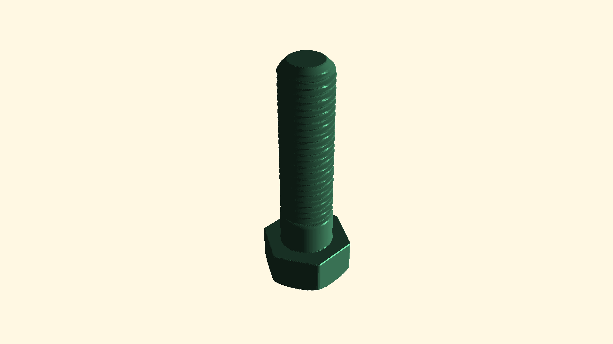

[](https://goreportcard.com/report/github.com/soypat/sdf)
[](https://godoc.org/github.com/soypat/sdf/sdf)

# sdf (originally sdfx)


A rewrite of the original CAD package [`sdfx`](https://github.com/deadsy/sdfx) for generating 2D and 3D geometry using [Go](https://go.dev/).

## Highlights
* GUI with real-time rendering using [sdf3ui](https://github.com/soypat/sdf3ui).
* 3d and 2d objects modelled with signed distance functions (SDFs).
* Minimal and idiomatic API.
* Render objects as triangles or save to STL, 3MF(experimental) file format.
* End-to-end testing using image comparison.
* `must` and `form` packages provide panicking and normal error handling basic shape generation APIs for different scenarios.
* Dead-simple, single method `Renderer` interface.


## Examples
For real-world examples with images see [examples directory README](./examples/).

See images of rendered shapes in [`render/testdata`](./render/testdata/).

Here is a rendered bolt from one of the unit tests under [form3_test.go](./render/form3_test.go)


## Roadmap
- [x] Clean up thread API mess
- [ ] Add a 2D renderer and it's respective `Renderer2` interface.
- [ ] Make 3D renderer multicore


## Comparison

### deadsy/sdfx

Advantages of [deadsy/sdfx](https://github.com/deadsy/sdfx):

- Widely used
- More helper functions
- Working 2D renderer

Advantages of soypat/sdf:

- Very fast rendering
  - `deadsy/sdfx` is over 2 times slower and has ~5 times more allocations.
- Minimal and idiomatic API
- `Renderer` interface is dead-simple, [idiomatic Go](https://pkg.go.dev/io#Reader) and not limited to SDFs
  - deadsy/sdfx `Renderer3` interface has filled `render` package with technical debt. See [Questionable API design](#questionable-api-design).
- Has `SDFUnion` and `SDFDiff` interfaces for blending shapes easily
  - `MinPoly` redesign to allow for _n_-degree polynomials. Also returns a sensible "undefined output" `MinFunc` before dividing by zero.
- No `nil` valued SDFs
  - deadsy/sdfx internally makes use of `nil` SDFs as "empty" objects. This can later cause panics during rendering well after the point of failure causing hard to debug issues.
- Well defined package organization.
  - deadsy/sdfx dumps helper and utility functions in [`sdf`](https://github.com/deadsy/sdfx/tree/master/sdf)
- End-to-end tested.
  - Ensures functioning renderer and SDF functions using image comparison preventing accidental changes.
- Error-free API under `must3` and `must2` packages for makers.
  - For simple projects these packages allow for streamlined error handling process using `panic` instead of returned errors.
  - deadsy/sdfx only allows for Go-style error handling like the `form3` and `form2` packages.
- Sound use of `math` package for best precision and overflow prevention.
  - `math.Hypot` used for all length calculations. `deadsy/sdfx` does not use `math.Hypot`.
- Uses gonum's `spatial` package
  - `sdfx` has own vector types with methods which [hurt code legibility](https://github.com/deadsy/sdfx/issues/48)
  - `spatial` types from gonum library with correct Triangle degeneracy calculation. `deadsy/sdfx`'s Degenerate calculation is incorrect.
- Idiomatic [`thread`](./form3/obj3/thread/thread.go) package. Define arbitrary threads with ease using `Threader` interface.
  - `deadsy/sdfx` defines threads with strings i.e. `"M16x2"`. `sdf` Defines threads with types corresponding to standards. i.e: `thread.ISO{D:16, P:2}`, which defines an M16x2 ISO thread.


## Contributing
See [CONTRIBUTING](./CONTRIBUTING.md).
# Why was sdfx rewritten?
The original `sdfx` package is amazing. I thank deadsy for putting all that great work into making an amazing tool I use daily. That said, there are some things that were not compatible with my needs:

### Performance
sdfx is needlessly slow. Here is a benchmark rendering a threaded bolt:

```
$ go test -benchmem -run=^$ -bench ^(BenchmarkSDFXBolt|BenchmarkBolt)$ ./render
goos: linux
goarch: amd64
pkg: github.com/soypat/sdf/render
cpu: AMD Ryzen 5 3400G with Radeon Vega Graphics    
BenchmarkSDFXBolt-8   	       6	 196941244 ns/op	14700786 B/op	   98261 allocs/op
BenchmarkBolt-8       	      13	  87547265 ns/op	18136785 B/op	   20754 allocs/op
PASS
ok  	github.com/soypat/sdf/render	4.390s
```
`BenchmarkBolt-8` is this implementation of Octree. `BenchmarkSDFXBolt-8` is the `sdfx` implementation of said algorithm.

### Questionable API design
* https://github.com/deadsy/sdfx/issues/48 Vector API redesign
* https://github.com/deadsy/sdfx/issues/35 Better STL save functions.
* https://github.com/deadsy/sdfx/issues/50 Removing returned errors from shape generation functions

The vector math functions are methods which yield hard to follow operations. i.e:
```go
return bb.Min.Add(bb.Size().Mul(i.ToV3().DivScalar(float64(node.meshSize)).
    Div(node.cellCounts.ToV3().DivScalar(float64(node.meshSize))))) // actual code from original sdfx.
```

A more pressing issue was the `Renderer3` interface definition method, **`Render`**
```go
type Renderer3 interface {
    // ...
    Render(s sdf.SDF3, meshCells int, output chan<- *Triangle3)
}
```

This presented a few problems:

1. Raises many questions about usage of the function Render- who closes the channel? Does this function block? Do I have to call it as a goroutine?

2. To implement a renderer one needs to bake in concurrency which is a hard thing to get right from the start. This also means all rendering code besides having the responsibility of computing geometry, it also has to handle concurrency features of the language. This leads to rendering functions with dual responsibility- compute geometry and also handle the multi-core aspect of the computation making code harder to maintain in the long run

3. Using a channel to send individual triangles is probably a bottleneck.

4. I would liken `meshCells` to an implementation detail of the renderer used. This can be passed as an argument when instantiating the renderer used.

5. Who's to say we have to limit ourselves to signed distance functions? [With the new proposed `Renderer` interface this is no longer the case](./render/render.go).


### `sdf` and `sdfx` consolidation
None planned.

My understanding is the `sdfx` author has a very different design goal to what I envision. See the bullet-list of issues at the start of [Questionable API design](#questionable-api-design).

## Logo work
Gopher rendition by [Juliette Whittingslow](https://www.instagram.com/artewitty/).  
Gopher design authored by [Renée French](https://www.instagram.com/reneefrench)
is licensed by the Creative Commons Attribution 3.0 licensed.