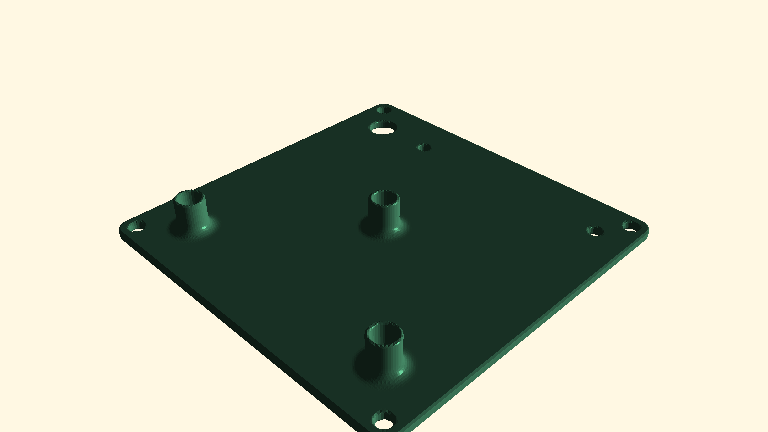

<!-- This file is auto generated. DO NOT EDIT-->
# Examples
Click on image to go to code directory.

## ADZ Nagano sensor cover

| Example | Execution Time | File size |
|---|---|---|
|[ADZ Nagano sensor cover](adz-sensor-cover)|1s|10MB|

## NPT Flange

| Example | Execution Time | File size |
|---|---|---|
|[NPT Flange](npt-flange)|0.5s|10MB|

## ATX Bench power supply mod

| Example | Execution Time | File size |
|---|---|---|
|[ATX Bench power supply mod](atx-bench-supply)|0.5s|4540kB|

## PCB spacer

| Example | Execution Time | File size |
|---|---|---|
|[PCB spacer](pcb-spacer)|1s|9736kB|

## PCB support

| Example | Execution Time | File size |
|---|---|---|
|[PCB support](pcb-support)|0.5s|7961kB|

