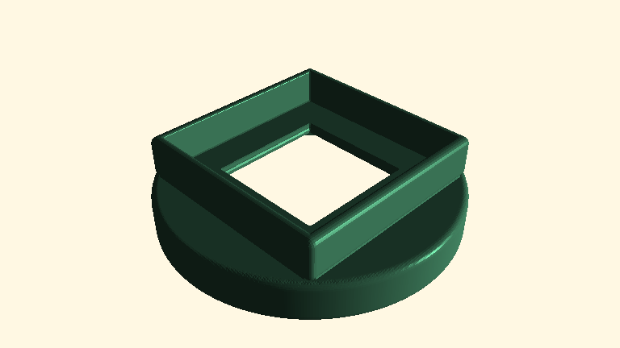
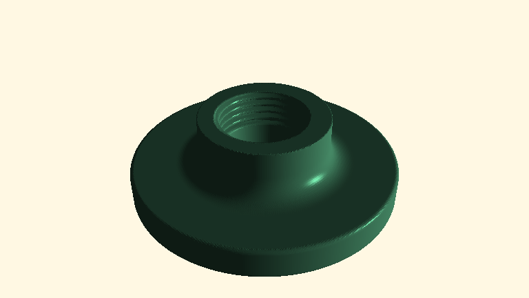
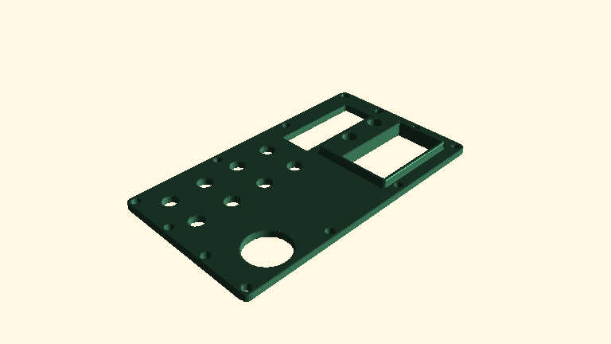
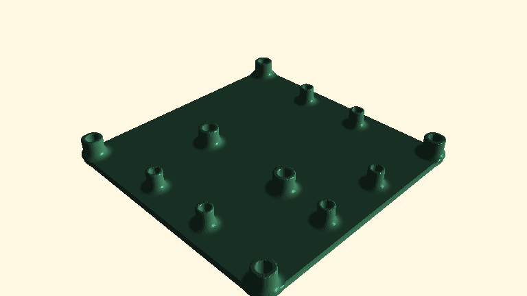

<!-- This file is auto generated. DO NOT EDIT-->
# Examples
Click on image to go to code directory.

## ADZ Nagano sensor cover

| Example | Execution Time | File size |
|---|---|---|
|ADZ Nagano sensor cover|1.5s|10MB|

## NPT Flange

| Example | Execution Time | File size |
|---|---|---|
|NPT Flange|1.5s|11MB|

## ATX Bench power supply mod

| Example | Execution Time | File size |
|---|---|---|
|ATX Bench power supply mod|1s|4540kB|

## PCB circuit spacer

| Example | Execution Time | File size |
|---|---|---|
|PCB circuit spacer|1s|9736kB|

